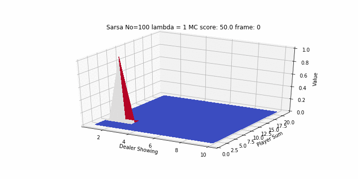

# Easy 21

Solving Easy 21 assigment from [Reinforcement Learning class by David Silver](http://www0.cs.ucl.ac.uk/staff/d.silver/web/Teaching.html) + RL guide for beginners.

Full instructions for this task are available [here](http://www0.cs.ucl.ac.uk/staff/d.silver/web/Teaching_files/Easy21-Johannes.pdf).



## About

This resource is intended to be a good place for beginners to get started with RL in a practical
way and is basically a summary of the [RL course by David Silver](http://www0.cs.ucl.ac.uk/staff/d.silver/web/Teaching.html). To obtain more information about the concepts here discussed please check the course!

Special thanks to:
  * David Silver for the great RL course;
  * [AnalogRL implementation's of easy21](https://github.com/analog-rl/Easy21) which had clean code + great graphs
    including the gifs you find in this notebook.

## How to run this?

You'll need [jupyter](http://jupyter.org/) and Python version >= 2.7. The python libraries you'll need can be found
at the top of the notebook.

```bash
git clone https://github.com/mari-linhares/easy21
cd easy21
jupyter notebook
```


Hope this helps and explore the environment :sunrise_over_mountains: :v:!
